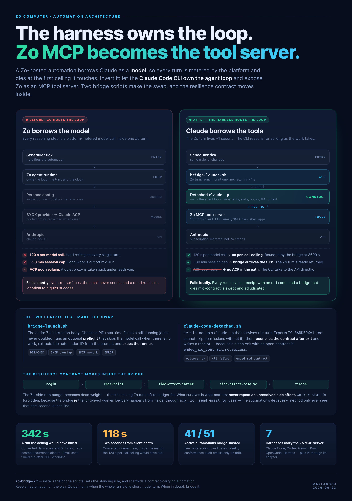

# zo-bridge-kit

**The harness owns the loop. Zo MCP becomes the tool server.**



Zo Computer enforces a **120-second ceiling on every model call** and a session cap on every
run. A scheduled automation whose work exceeds either one dies with nothing surfaced — no
error, no email, and a dead run that reads exactly like a quiet success.

This kit inverts the stack. Instead of Zo owning the agent loop and borrowing Claude as a
*model*, the **Claude Code CLI owns the loop** and borrows Zo as an *MCP tool server*. The
Zo turn shrinks to about a second: it launches a detached `claude -p` and returns. No Zo
model call happens, so no Zo model-call limit applies.

```
scheduler tick -> bridge-launch.sh        Zo turn: ~1 s, prints one line, returns
                    -> claude -p          owns the agent loop, no ceiling
                         <-> zo MCP       email, SMS, files, shell, apps
```

## Measured, not theoretical

| | |
|---|---|
| **342 s** | A converted daily scan, exit 0. Its previous Zo-hosted occurrence died at *"Email send timed out after 300 seconds."* |
| **118 s** | A converted queue drain — two seconds inside the margin the 120 s ceiling would have cut. |
| **41 / 51** | Active automations bridge-hosted on the reference deployment, zero outstanding candidates. |
| **7** | CLI harnesses carrying the Zo MCP server, so any of them can host a persona with the full Zo tool set. |

## Quickstart

```bash
set -a; . /root/.zo_secrets; set +a         # scripts need ZO_MCP_API_KEY

python3 scripts/preflight.py                # claude, bun, zo MCP, writable dirs
python3 scripts/install.py --apply          # write the two bridge scripts
python3 scripts/set-bridge-rule.py --apply  # make bridge hosting the build default
```

Then build one:

```bash
python3 scripts/new-bridge-automation.py \
  --title '[SYS] Sweep Stale Leases' \
  --rrule 'FREQ=DAILY;BYHOUR=7;BYMINUTE=40;BYSECOND=0' \
  --job sweep-stale-leases --spec my-spec.md --apply
```

Every mutating script is **dry-run by default**, prints a diff, and reads its change back
from the platform before reporting success.

## What is in the box

- **`assets/bridge-launch.sh`** — the entire Zo instruction body. PID+starttime overlap
  guard, optional preflight that skips the model call when there is no work, automation-ID
  extraction, then `exec` the runner. Prints exactly one of `DETACHED`, `SKIP overlap`,
  `SKIP nowork`, `ERROR`.
- **`assets/claude-code-detached.sh`** — `setsid nohup` a `claude -p` that outlives the
  turn, then **reconciles the resilience contract after the CLI exits** and writes a
  receipt. A clean exit with an open contract is `ended_mid_contract`, not success.
- **`scripts/install.py`** — installs both, refusing to clobber a differing live script
  without `--force` (live automations reference the launcher by absolute path).
- **`scripts/set-bridge-rule.py`** — creates or updates the standing rule that makes bridge
  hosting the default for new automations. Idempotent; matched by signature, verified on
  read-back.
- **`scripts/new-bridge-automation.py`** — scaffolds a new automation end to end and
  refuses the traps: no `COUNT=` rrules, no null `next_run`.
- **`docs/ARCHITECTURE.md`** — why the loop moves, what each limit actually is, and why
  `exit_code` is not the verdict.

## Relationship to `automation-resilience`

The durable run contract — `begin` / `checkpoint` / `side-effect-intent` /
`side-effect-resolve` / `finish`, plus the controller that adjudicates a run whose owner
disappeared — belongs to the `automation-resilience` skill. This kit does **not**
reimplement it. It moves that contract *inside* the bridge and wires the two together.

On a host that already runs `automation-resilience`, use its `convert-to-bridge.py` to
migrate existing automations and its `audit-bridge-conformance.py` to watch for drift. Use
this kit to stand the pattern up and to build new automations on it.

## Requirements

Claude Code CLI · `bun` · a reachable `zo` MCP server (`https://api.zo.computer/mcp` with
`ZO_MCP_API_KEY`) · `IS_SANDBOX=1` when running as root, which the runner exports for you.

## Install as a skill

```bash
git clone https://github.com/marlandoj/zo-bridge-kit.git /home/workspace/Skills/zo-bridge-kit
```

The repository root *is* the skill directory — `SKILL.md` sits at the top level and the
directory name matches its `name:` field.
