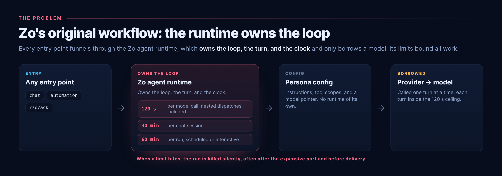
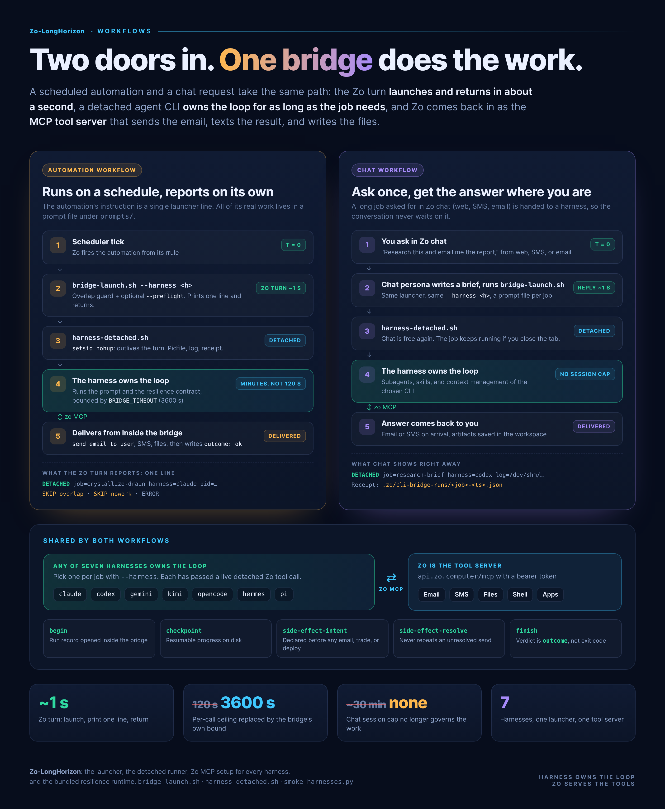
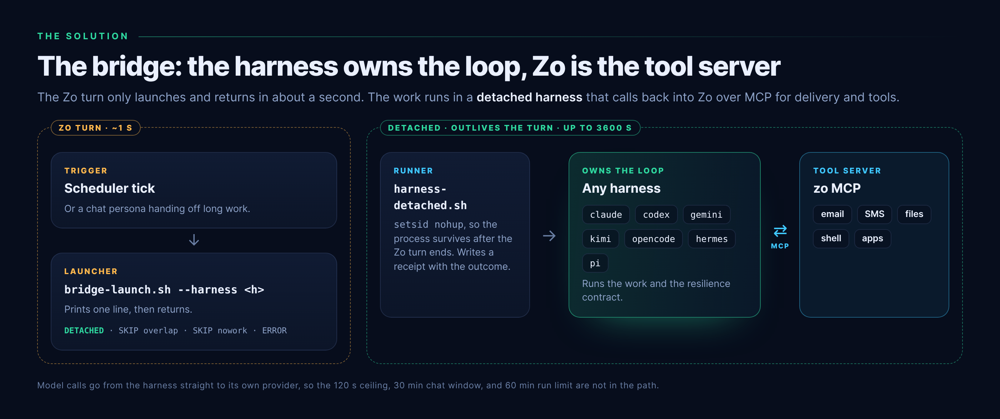

# zo-bridge-kit

**The harness owns the loop. Zo MCP becomes the tool server.**

## The problem: Zo owns the loop, and Zo's clock ends it

Out of the box, every Zo entry point — chat, SMS, email, a scheduled automation, a
`/zo/ask` call — runs through the same Zo agent runtime. The runtime owns the agent loop and
borrows a model through the persona's provider:



Because the runtime owns the clock, three platform limits bound every piece of work:

| Limit | What it bounds | What happens when it bites |
|---|---|---|
| **120 s per model call** | Every turn inside the runtime, including nested `/zo/ask` dispatches, consensus panels, and MoA lineups | The call is killed. A slow-reasoning model, or one long tool-heavy turn, ends the run. |
| **30-minute chat session** | An interactive conversation | Long builds, research, and multi-step work are cut off mid-flight and must be resumed by hand. |
| **60-minute run limit** | Any single run, scheduled or interactive | Work stops wherever it happens to be, often after the expensive part and before delivery. |

All three fail **silently**. A scheduled automation that hits one usually sends no error and
no email, and the dead run reads exactly like a quiet success. Choosing a faster model does
not fix it: a nested call to a slow model still dies at 120 s.

## The solution: the harness owns the loop, Zo becomes the tool server

zo-bridge-kit inverts the stack. Instead of Zo owning the agent loop and borrowing a model,
an **agent CLI owns the loop** and borrows Zo as an **MCP tool server**. The Zo turn shrinks
to about a second: it launches a detached harness and returns. No Zo model call happens, so
none of the three limits applies.





| Limit | Under the bridge |
|---|---|
| 120 s per model call | Not in the path. Model calls go from the harness straight to its own provider. |
| 30-minute chat session | A chat hands long work to a detached harness and replies in about a second; the result arrives by email or SMS. |
| 60-minute run limit | The Zo run lasts about a second. The detached harness bounds itself at `BRIDGE_TIMEOUT` (default 3600 s, adjustable). |

What the kit adds so the inversion is safe:

- **Any of seven harnesses** hosts the loop — Claude Code, Codex CLI, Gemini CLI, Kimi Code
  CLI, OpenCode, Hermes Agent, or Pi — chosen per automation with `--harness`.
- **Zo MCP wired into every harness**, so a detached run keeps email, SMS, files, shell, and
  app integrations.
- **The resilience contract runs inside the bridge.** Because Zo now sees a one-second
  success, the platform can no longer report a failure; the contract's checkpoints and
  side-effect records let the recovery controller find a bridge that never came back, and
  never repeat an email or trade whose outcome is uncertain.
- **Overlap and no-work guards** in the launcher, so a slow run is not started twice and an
  empty queue costs nothing.

## Measured, not theoretical

| | |
|---|---|
| **342 s** | A converted daily scan, exit 0. Its previous Zo-hosted occurrence died at *"Email send timed out after 300 seconds."* |
| **118 s** | A converted queue drain — two seconds inside the margin the 120 s ceiling would have cut. |
| **41 / 51** | Active automations bridge-hosted on the reference deployment, zero outstanding candidates. |
| **6 / 7** | Harnesses that completed a real Zo MCP tool call from a detached run on the reference host (15–25 s each). The seventh, Hermes, was blocked only by its providers' billing. |

## Everything you need is in the repo

A fresh Zo host needs nothing but this repository:

| Needed | Where it comes from |
|---|---|
| The seven agent CLIs | `scripts/install-harnesses.py` installs them from `harnesses/harnesses.json` |
| Zo MCP in every harness | `scripts/configure-zo-mcp.py` writes each config; `docs/ZO-MCP-SETUP.md` explains the token |
| The run contract and recovery controller | bundled in `vendor/automation-resilience/`, installed by `scripts/install.py` |
| The launcher and detached runner | `assets/bridge-launch.sh`, `assets/harness-detached.sh` |
| Harnesses as Zo personas | `scripts/register-personas.py` |
| Bridge hosting as the default for new automations | `scripts/set-bridge-rule.py` |

## Setup

```bash
git clone https://github.com/marlandoj/zo-bridge-kit.git /home/workspace/Skills/zo-bridge-kit
cd /home/workspace/Skills/zo-bridge-kit
```

**1. Zo MCP token.** In Zo, create an access token (Settings → Advanced → Access Tokens) and
save it as the secret `ZO_MCP_API_KEY` (Settings → Advanced → Secrets). Then load secrets
into your shell — every script reads them from the environment:

```bash
set -a; . /root/.zo_secrets; set +a
```

Full walkthrough, per-harness config entries, and troubleshooting: [`docs/ZO-MCP-SETUP.md`](docs/ZO-MCP-SETUP.md).

**2. Harnesses.** Install whichever are missing, then log each one in to its provider:

```bash
python3 scripts/install-harnesses.py            # what is installed, plus each login hint
python3 scripts/install-harnesses.py --apply    # install the missing ones
```

**3. Wire Zo MCP into every harness, and prove it.**

```bash
python3 scripts/configure-zo-mcp.py --apply --verify
python3 scripts/smoke-harnesses.py              # each harness makes a real Zo tool call, detached
```

**4. Install the bridge and the resilience runtime.**

```bash
python3 scripts/preflight.py
python3 scripts/install.py --apply
```

**5. Make it the standard, and register the personas.**

```bash
python3 scripts/set-bridge-rule.py --apply
python3 scripts/register-personas.py --apply --model claude=byok:<full-uuid>
```

Every mutating script is **dry-run by default**, prints what it would change, and reads its
change back before reporting success.

## Build an automation on any harness

```bash
python3 scripts/new-bridge-automation.py \
  --title '[SYS] Sweep Stale Leases' \
  --rrule 'FREQ=DAILY;BYHOUR=7;BYMINUTE=40;BYSECOND=0' \
  --job sweep-stale-leases --harness codex --spec my-spec.md --apply
```

Convert an existing contract-carrying automation:

```bash
python3 scripts/convert-to-bridge.py --automation-id <full-uuid> --job <slug> --harness gemini --apply
```

## What is in the box

| Path | Purpose |
|---|---|
| `assets/bridge-launch.sh` | The whole Zo instruction body. Overlap guard, optional no-work preflight, `--harness`, then `exec` the runner. Prints one of `DETACHED`, `SKIP overlap`, `SKIP nowork`, `ERROR`. |
| `assets/harness-detached.sh` | Detaches any of the seven harnesses headless, loads host secrets, applies each harness's unattended-run fixes, then **reconciles the resilience contract after the CLI exits** and writes a receipt. |
| `assets/claude-code-detached.sh` | Compatibility shim for older Claude-only callers. |
| `vendor/automation-resilience/` | The bundled run contract, recovery controller, mailbox verifier, conformance audit, and their tests. |
| `harnesses/harnesses.json` | One entry per harness: install, headless invocation, model variable, MCP config, persona. |
| `harnesses/persona-template.md` | Prompt for the Zo persona created per harness. |
| `scripts/install-harnesses.py` | Install the agent CLIs. |
| `scripts/configure-zo-mcp.py` | Write and verify the `zo` MCP entry in every harness config. |
| `scripts/smoke-harnesses.py` | Prove each harness can run detached and complete a Zo MCP call. |
| `scripts/install.py` | Install launcher, runner, and runtime; refuses to clobber a differing live script. |
| `scripts/preflight.py` | Check a host is ready. |
| `scripts/register-personas.py` | Create a Zo persona per harness. |
| `scripts/set-bridge-rule.py` | Make bridge hosting the default for new automations. |
| `scripts/new-bridge-automation.py` | Scaffold a new bridge-hosted automation. |
| `scripts/convert-to-bridge.py` | Move an existing automation onto the bridge. |
| `docs/ARCHITECTURE.md` | Why the loop moves, what each limit actually is, why `exit_code` is not the verdict. |
| `docs/HARNESSES.md` | Per-harness install, invocation, authentication, and the fixes each needed. |
| `docs/ZO-MCP-SETUP.md` | Token, secrets, per-harness config, troubleshooting. |

## Judge runs by outcome

Every harness's one-shot mode exits the moment the model stops emitting, so a clean exit can
hide unfinished work. The runner reads the resilience run after the CLI exits and writes an
`outcome` to the receipt: `ok`, `cli_failed`, or `ended_mid_contract` (exit 0 with the
contract still open). Confirm delivery from outside the run — mailbox, file, or queue — not
from the bridge's own report.

## Requirements

A Zo Computer host, Python 3.11+, `bun`, `npm` (and `pip` for Hermes), and a Zo access
token. Each harness needs its own provider login or API key.

The repository root is the skill directory: `SKILL.md` sits at the top level and the
directory name matches its `name:` field.

## Provider terms

The kit runs official CLIs on your own host with your own credentials. Under Anthropic's [Consumer Terms](https://www.anthropic.com/legal/consumer-terms):

- **Your login, your billing.** Authenticate each harness yourself (`claude login`, or your own API key). The kit installs the official CLIs unmodified and never bundles, shares, or resells credentials.
- **Headless is supported.** `claude -p` is a supported paid-plan path (the [Agent SDK](https://support.claude.com/en/articles/15036540-use-the-claude-agent-sdk-with-your-claude-plan)). It is metered separately from interactive usage; Anthropic has paused that separate billing as of September 2026, and throttling may still apply.
- **No hosted service on a subscription login.** The terms let end users sign in to the unmodified client themselves, and forbid operating a hosted product for them off that login. This kit automates your work on your host; if you ever run it for end users, use an API key under your own agreement.
- **Usage Policy applies.** Unattended runs are bound by the [Anthropic Usage Policy](https://www.anthropic.com/legal/aup); every other harness follows its provider's equivalent terms.
